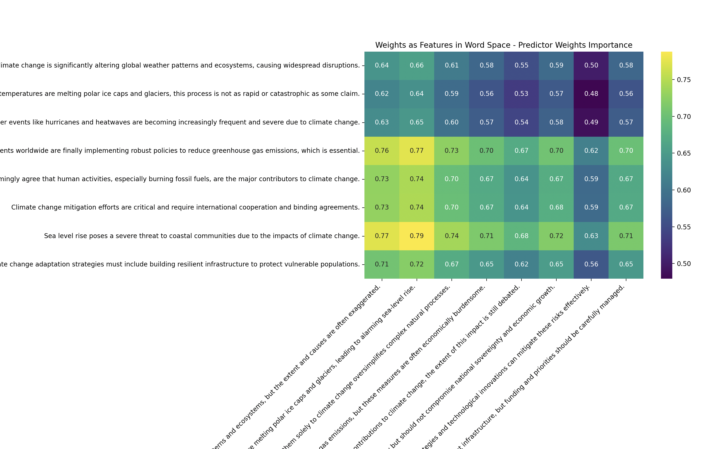
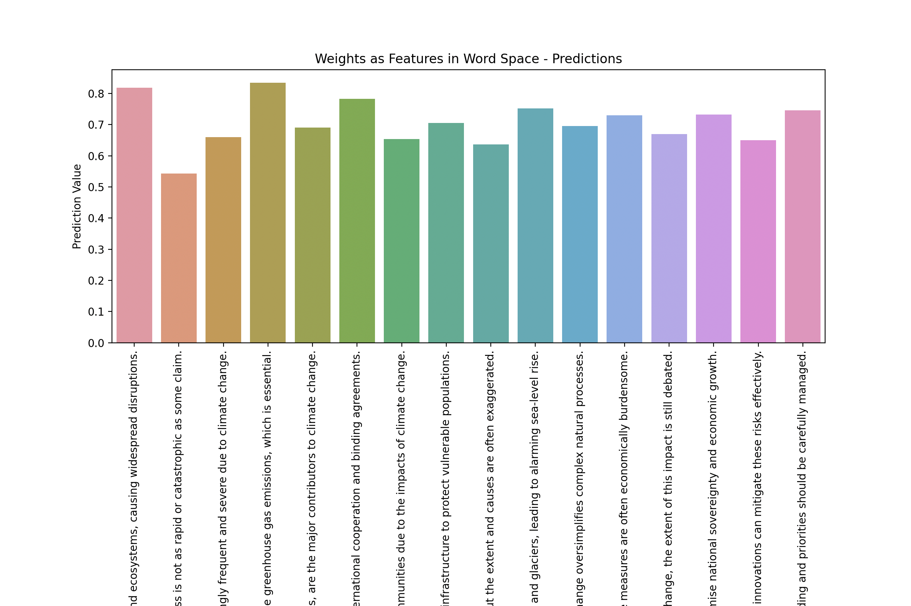

## Joint Embeddings Predictor for Agent Goal Affinity/Alignment

This repo demonstrates JEPA for learning a feature space over two language corpora and the potential for using JEPA learnt feature spaces for language generation. Specifically, it is applied here to demonstrate the potential of JEPA in agent alignment / affinity in a dynamic agent based ecosystem. 

#### Approach:

The JEPA model is trained to establish connections between sentences1 and sentences2. This training process involves optimizing the predictor's weights to effectively capture and differentiate semantic similarities and differences between the two sets of sentences. The predictor, through its training, learns to output embeddings (joint1 and joint2) that encode the relationships between sentences1 and sentences2 based on their BERT embeddings.

#### Results:

##### JEPA Weights Importance

The weights of the predictor are mapped back into the original sentence space. This mapping allows for the interpretation of how these learned weights influence the embeddings of sentences1 and sentences2. By examining these mapped weights, one can understand which aspects or dimensions of the original sentences contribute most significantly to the predictor's decision-making process. This step is crucial for interpreting and visualizing the semantic relationships identified by the JEPA model in a meaningful way.

Approach: 
- The values in the heatmap indicate how strongly the predictor model's weights are influenced by the combined joint embedding of each pair of sentences.
- High values in the heatmap suggest that the predictor's weights have a strong influence on the joint embedding of the corresponding pair of sentences.
- Low values suggest a weaker influence.
- The heatmap does not show the actual predictions (i.e., output values) made by the predictor model for each pair of sentences.
- It does not directly reflect how the model would score or classify each pair of sentences in terms of similarity, relevance, or any other specific output metric.

Interpretting the visualisation:
- By visualizing the heatmap of importance values, you gain insights into which pairs of sentences the model considers most relevant based on its fixed weights.
- This helps understand which features or embeddings from the sentences are critical for the model's decision-making process.
- You can compare different pairs of sentences to see how they stack up in terms of importance, identifying patterns or biases in the model's focus.
- Since the weights are fixed after training, the importance values reflect how well each pair of sentences fits the learned patterns encoded in those weights.
- This analysis is a reflection of the model's internal representation and the relationships it has learned during training.

##### Prediction

The JEPA predictor is used to make predictions on the sentences it was trained on.

Approach: 
- Displays the reduced dimensionality of sentence embeddings using Principal Component Analysis (PCA).
- Uses joint embeddings from two autoencoders to represent the combined information from each sentence pair.
- Shows the predictions made by the JEPA predictor model for each sentence.
- The heatmap represents the importance of the predictor model's weights for the joint embeddings of pairs of sentences.
- Illustrates how the model views the relationships between different sentence pairs based on their embeddings.

How to Interpret the Visualization

Bar Plot of Predictions:
- Height of Bars: Represents the prediction value for each sentence.
- Comparison Across Sentences: Higher bars indicate higher prediction values, suggesting the model finds certain sentences more relevant or significant.
- Distribution: Helps identify any trends or patterns in the predictions across different sentences.

PCA Reduced Embeddings:
- Clusters of Sentences: Sentences close to each other in the PCA plot have similar embeddings, suggesting they are contextually or semantically similar.
- Principal Components (PCs): The axes represent the principal components, which are the directions of maximum variance in the data.
- Source of Sentences: The color or label indicating the source (sentences1 or sentences2) helps in understanding how different sets of sentences are positioned relative to each other.

Heatmap of Predictor Weights Importance:
- Heatmap Values: Indicates the importance of the predictor model's weights for the joint embeddings.
- High Values: Suggest a strong influence of the predictor's weights on the joint embeddings for those pairs of sentences.
- Low Values: Indicate a weaker influence.
- Patterns: Helps identify which sentence pairs the model considers most relevant and which features or embeddings are critical for the model's decisions.

#### Scenario:

JEPA is used to learn the feature space of utterance of two personas (or agents) relating to climate change:

Agent A:

"Climate change is significantly altering global weather patterns and ecosystems, causing widespread disruptions."
"Rising global temperatures are rapidly melting polar ice caps and glaciers, leading to alarming sea-level rise."
"Extreme weather events like hurricanes and heatwaves are becoming increasingly frequent and severe due to climate change."
"Governments worldwide are finally implementing robust policies to reduce greenhouse gas emissions, which is essential."
"Scientists overwhelmingly agree that human activities, especially burning fossil fuels, are the major contributors to climate change."
"Climate change mitigation efforts are critical and require international cooperation and binding agreements."
"Sea level rise poses a severe threat to coastal communities due to the impacts of climate change."
"Climate change adaptation strategies must include building resilient infrastructure to protect vulnerable populations."

Agent B:

"Climate change is altering global weather patterns and ecosystems, but the extent and causes are often exaggerated."
"While rising global temperatures are melting polar ice caps and glaciers, this process is not as rapid or catastrophic as some claim."
"Extreme weather events are becoming more frequent, but attributing them solely to climate change oversimplifies complex natural processes."
"Governments worldwide are implementing policies to reduce greenhouse gas emissions, but these measures are often economically burdensome."
"While many scientists agree on human contributions to climate change, the extent of this impact is still debated."
"Climate change mitigation efforts are necessary but should not compromise national sovereignty and economic growth."
"Sea level rise threatens coastal communities, but adaptive strategies and technological innovations can mitigate these risks effectively."
"Climate change adaptation strategies include building resilient infrastructure, but funding and priorities should be carefully managed."

Areas of Agreement:

1. Affordability of Renewable Energy Technologies: Both Person A and Person B agree that making renewable energy technologies affordable is crucial for their widespread adoption. They likely support initiatives that aim to reduce costs and increase accessibility to renewable energy sources.
2. Impact on Low-Income Communities: They both recognize that low-income communities often suffer disproportionately from the impacts of climate change. This agreement suggests a shared concern for addressing environmental justice issues and ensuring these communities receive adequate support and resources.
3. Economic Disparities and Access to Climate-Resilient Infrastructure: Person A and Person B acknowledge that economic disparities can hinder access to climate-resilient infrastructure and resources. They likely support policies and initiatives aimed at reducing these disparities to enhance resilience in vulnerable populations.
4. Role of Carbon Pricing Mechanisms: They agree that carbon pricing mechanisms are important tools for incentivizing businesses to reduce emissions. This agreement implies support for market-based approaches to tackling climate change through economic incentives.
5. Benefits of Energy-Efficient Housing: Both agree that energy-efficient housing not only reduces utility costs but also lowers carbon footprints. This shared perspective likely supports policies promoting energy efficiency standards in building codes and incentives for retrofitting existing buildings.
6. Promotion of Renewable Energy Subsidies: They both see the value in subsidies that promote the adoption of clean energy technologies. This agreement suggests support for government intervention to accelerate the transition towards renewable energy sources.
7. Role of Green Bonds: Person A and Person B recognize that green bonds play a role in funding projects that support climate resilience and sustainability. This agreement indicates support for innovative financial instruments that mobilize capital for climate-related initiatives.
8. Importance of Public-Private Partnerships: They agree on the crucial role of public-private partnerships in financing climate adaptation projects. This shared perspective likely advocates for collaboration between governments, businesses, and non-profit organizations to address climate challenges effectively.

Areas of Disagreement:

1. Extent of Climate Change Impact: Person A believes climate change is significantly altering global weather patterns and ecosystems, causing widespread disruptions, while Person B thinks the extent and causes are often exaggerated.
2. Rate of Polar Ice Melting: Person A states that rising global temperatures are rapidly melting polar ice caps and glaciers, leading to alarming sea-level rise, whereas Person B believes this process is not as rapid or catastrophic as claimed.
3. Attribution of Extreme Weather Events: Person A attributes increasing frequency and severity of extreme weather events like hurricanes and heatwaves to climate change, whereas Person B thinks attributing them solely to climate change oversimplifies complex natural processes.
4. Effectiveness of Government Policies: Person A asserts that governments worldwide are finally implementing robust policies to reduce greenhouse gas emissions, which is essential, whereas Person B believes these policies are often economically burdensome.
5. Consensus on Human Contribution: Person A states that scientists overwhelmingly agree that human activities, especially burning fossil fuels, are major contributors to climate change, while Person B acknowledges human contribution but suggests the extent is still debated among scientists.
6. International Cooperation on Mitigation: Person A believes climate change mitigation efforts are critical and require international cooperation and binding agreements, whereas Person B supports mitigation efforts but emphasizes they should not compromise national sovereignty and economic growth.
7. Severity of Sea Level Rise: Person A emphasizes that sea level rise poses a severe threat to coastal communities due to climate change, whereas Person B acknowledges the threat but believes adaptive strategies can effectively mitigate risks.
8. Approach to Climate Adaptation: Person A argues that climate change adaptation strategies must include building resilient infrastructure to protect vulnerable populations, while Person B agrees but suggests careful management of funding and priorities.